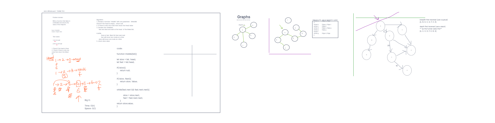

# Graph Implementation

## Problem Domain

Implement your own Graph. The graph should be represented as an adjacency list, and should include the following methods: add node, add edge, get nodes, get neighbors, size.

## Methods

add node
Arguments: value
Returns: The added node
Add a node to the graph

add edge
Arguments: 2 nodes to be connected by the edge, weight (optional)
Returns: nothing

Adds a new edge between two nodes in the graph
If specified, assign a weight to the edge
Both nodes should already be in the Graph
get nodes

Arguments: none
Returns all of the nodes in the graph as a collection (set, list, or similar)
Empty collection returned if there are no nodes

get neighbors
Arguments: node
Returns a collection of edges connected to the given node
Include the weight of the connection in the returned collection
Empty collection returned if there are no nodes

size
Arguments: none
Returns the total number of nodes in the graph
0 if there are none

## viz

## Approach & Efficiency

The approach used in this implementation of a graph in JavaScript is an adjacency list representation. In this approach, each node in the graph is associated with a list of its neighbors. Each entry in the list contains the node's neighbor and optionally, the weight of the edge connecting the two nodes. (helpful for future implementations of Dijkstra's algorithm)  we could also init the nodes as objects instead of primitives, and add the neighbors as an array of objects with the neighbor and weight as properties.  This would allow for more flexibility in the future.

The adjacency list representation is a space-efficient way to represent graphs, especially for sparse graphs where the number of edges is much smaller than the maximum possible number of edges. In such cases, the adjacency list representation requires O(E + V) space, where E is the number of edges and V is the number of vertices.

In terms of time complexity, the adjacency list representation allows for efficient access to a node's neighbors. Finding the neighbors of a node takes O(1) time since we can simply access the node's list of neighbors in constant time. Adding a node to the graph also takes O(1) time, as it simply involves adding a new entry to the adjacency list. Adding an edge between two nodes takes O(1) time since we can simply append to each node's list of neighbors. Finally, getting all nodes in the graph or the total number of nodes in the graph takes O(n) time since we need to iterate through the entire adjacency list.

Overall, the adjacency list representation provides a good balance of space and time efficiency for graphs, particularly for sparse graphs. This implementation using JavaScript classes and methods provides a simple and flexible way to work with graphs in JavaScript.
