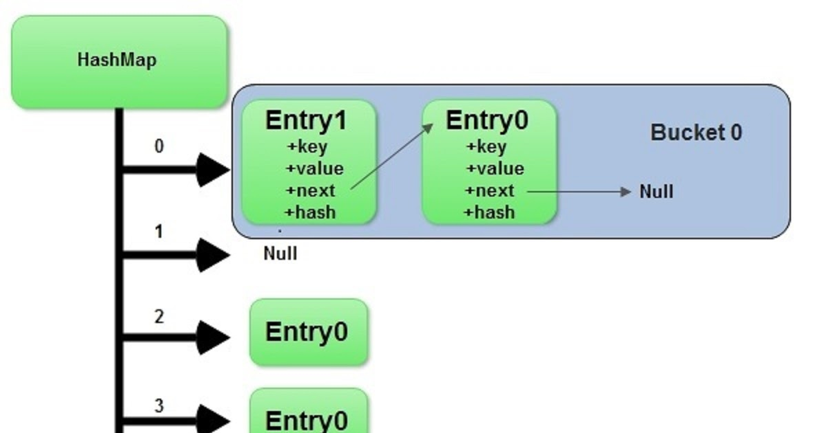

# HashMap LeftJoin

challenge is write a function called left join

Arguments: two hash maps
The first parameter is a hashmap that has word strings as keys, and a synonym of the key as values.
The second parameter is a hashmap that has word strings as keys, and antonyms of the key as values.

## Approach

Approach:
The goal of this function is to perform a left join on two hash maps: one containing synonyms and the other containing antonyms. The left join should retain all the keys from the synonyms hash map and should combine the corresponding antonyms, if available, from the antonyms hash map. If a key in the synonyms hash map does not exist in the antonyms hash map, the combined value should include a null antonym.

## Step-Through

Approach:
The goal of this function is to perform a left join on two hash maps: one containing synonyms and the other containing antonyms. The left join should retain all the keys from the synonyms hash map and should combine the corresponding antonyms, if available, from the antonyms hash map. If a key in the synonyms hash map does not exist in the antonyms hash map, the combined value should include a null antonym.

## Function Details/ Algorithm

Initialize a new hash table called "result" with the same size as the synonyms hash map.
For each key in the synonyms hash map, do the following:
a. Get the synonym value associated with the key.
b. Check if the key exists in the antonyms hash map.
c. If the key exists in the antonyms hash map, get the antonym value.
d. If the key does not exist in the antonyms hash map, use null as the antonym value.
e. Set the combined synonym and antonym values in the result hash map using the current key.
Return the result hash map containing the combined values of synonyms and antonyms.

## Uml

couldnt partner and invision was crazy slow due to bandwidth.
found a viz at [link](https://javarevisited.blogspot.com/2011/02/how-hashmap-works-in-java.html#axzz7xOLndUln)

