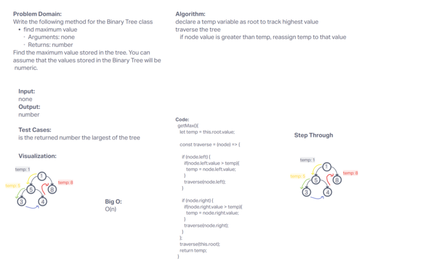
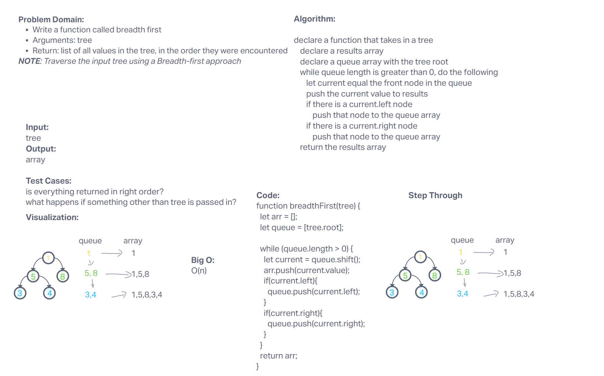

# Trees

## collaborators

joe davit, jordan covington, adrienne frey, ken holt.

trees are a data structure that is a collection of nodes, with right and left properties

## Challenge

the challenge was to build out a simple tree with some native methods, and test those methods

## Approach & Efficiency

some of the code was demo'd in class, and some of put into place myself. not all working as intended but close.
big O is O(n) for space for this data structure, and the O for methods depends but its mostly O1

## API

currently the add, preOrder,inOrder,postOrder and contains all work and max

## fizzbuzz

using node values and trees, we can use fizzbuzz on a tree. collaborators martin hansen& jonathan staib

## code challenge 3/9/2023

i had errands to run and coul not partner. here is my  code challenge work, timeboxed to 30 mins. a more elegant solution exists using a while loop instead im sure.
.png)
