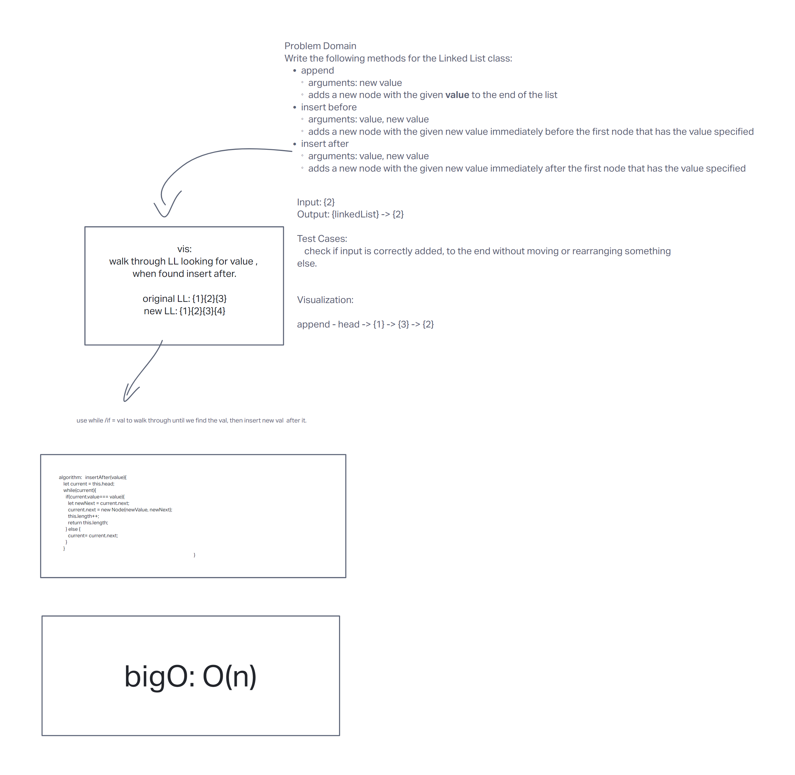
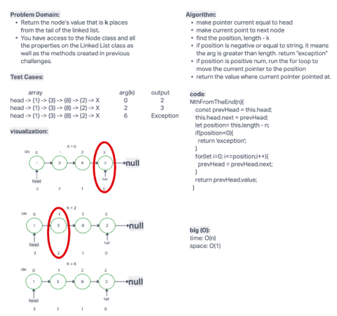

# Linked List

collabs and conspirators, Joe Davitt, Jordan, Adrienne

A linked list is a data structure that consists of a sequence of nodes, each containing an element of data and a reference (or pointer) to the next node in the sequence. Unlike arrays, linked lists do not have a fixed size, and nodes can be added or removed from the list at any time.

## Types of Linked Lists

I've done a singly linked list but,
There are several types of linked lists, including:

Doubly Linked List: Each node in the list contains a reference to both the next and previous nodes in the sequence.

Circular Linked List: A linked list in which the last node points back to the first node, forming a loop.

## Whiteboard Process

## Operations on Linked Lists

operations that can be performed on this linked list include:

insert: adds a node to beginning of linked list

toString: converts to string

includes: takes a value as parameter and walks through linked list node by node, until finding value and returning true, or finding null and returning false.

append: adds a node with 'value' to the end of list

insertAfter: takes a value and new value and inserts the 'newValue' after the given 'value'

insertBefore: same as above but reversed.

reverse: reverses the order of the linked list in place

NthFromTheEnd: takes an integer as a parameter and returns the node with that "index"

zipLists : takes two lists as parameters, and combined them in alternating fashion, a la zipper.

Advantages and Disadvantages
Some advantages of linked lists include:

Dynamic size: Linked lists can grow or shrink in size as needed, without requiring any reallocation of memory.

Efficient insertion and deletion: Adding or removing nodes from a linked list can be done in constant time, assuming that the position of the node is known.

Some disadvantages of linked lists include:

No random access: Unlike arrays, linked lists do not allow for constant-time random access to elements.

Extra memory overhead: Each node in a linked list requires an additional pointer to the next node, which can increase memory usage.

<!-- # Challenge Title -->
<!-- Description of the challenge -->

<!-- ## Whiteboard Process -->
<!-- Embedded whiteboard image -->

<!-- ## Approach & Efficiency -->
<!-- What approach did you take? Why? What is the Big O space/time for this approach? -->

<!-- ## Solution -->
<!-- Show how to run your code, and examples of it in action -->